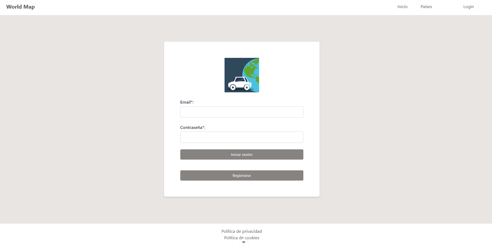
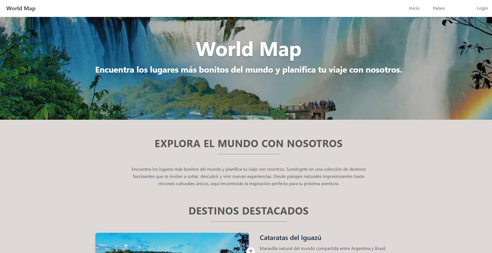
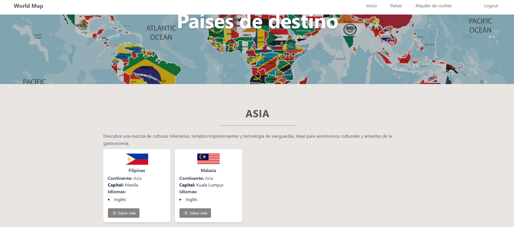
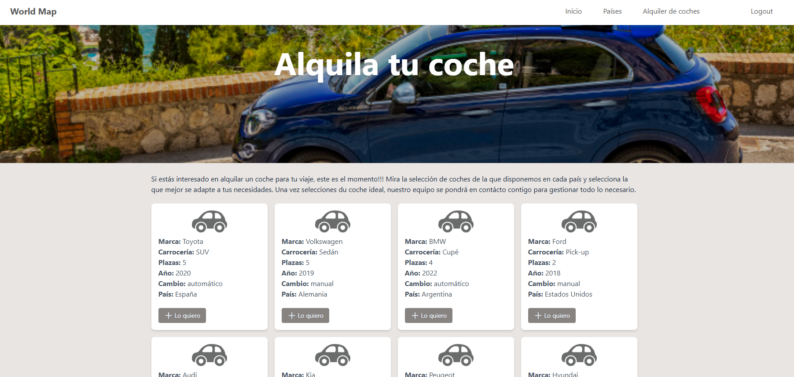
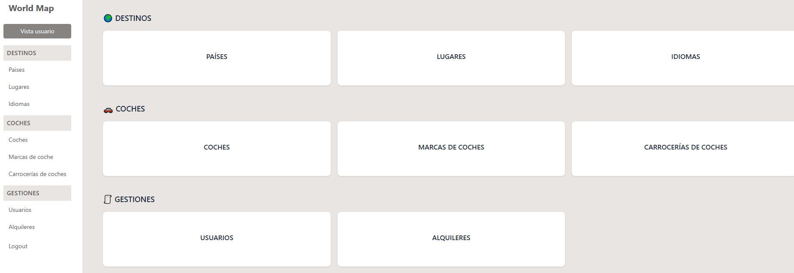
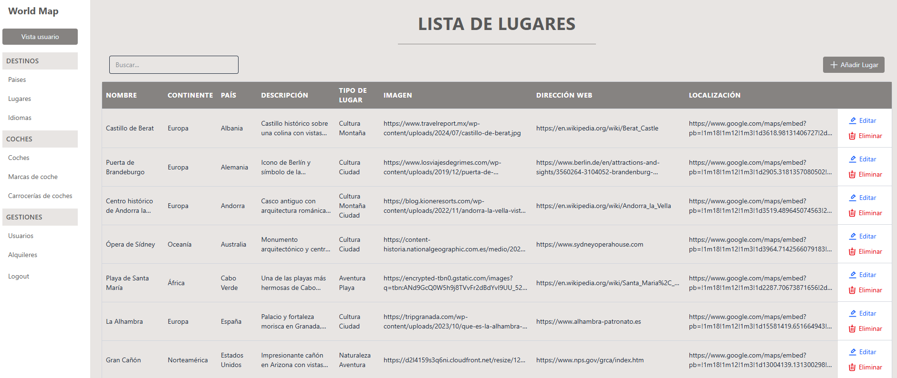
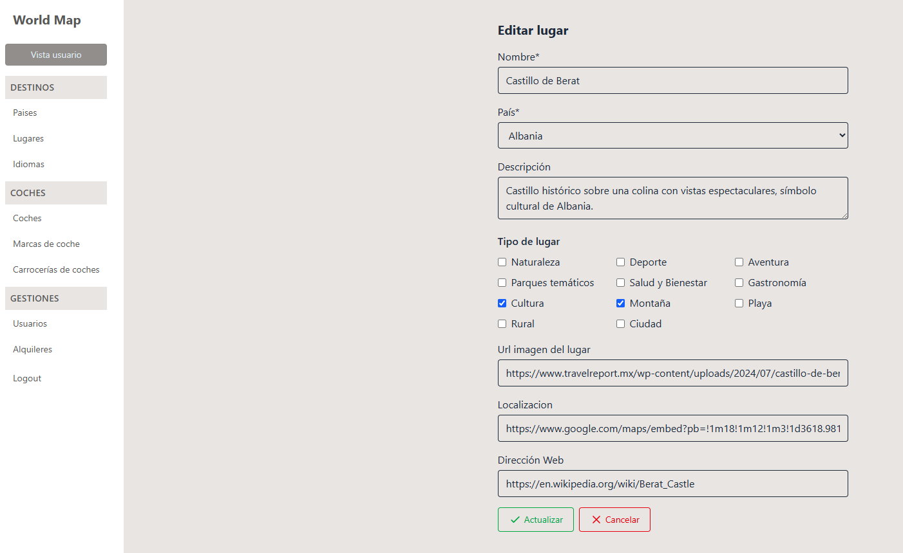

## MAPA VIAJERO

Esta aplicación fullstack está diseñada para todas aquellas personas que aman viajar y encontrar los lugares más bonitos del mundo.

La aplicación tiene rutas publicas como privadas a las que se puede acceder mediante la página de login. Una vez ahí, se diferencian dos partes, el lado de cliente y el lado de administrador.

Por una parte están las vistas del cliente, donde se pueden visualizar los diferentes rincones del mundo y cierta información sobre ellos. Estas vistas son iguales para usuarios logados como no logados, lo que cambia es que el usuario logado tiene la opción de alquilar un coche en cualquier lugar del mundo.

Por otra parte, está el panel de control de los administradores de la aplicación que son los encargados de alimentar la API mediante tablas y formularios simples.

Dentro de las carpetas mapaviajero-api y mapaviajero-web se encuentran otros archivos README con más información sobre cada parte del proyecto, las indicaciones de isntalación, despliegue y comprensión.
